# Try Vegan

[Try Vegan](https://delboy.github.io/Try-Vegan/) is a responsive website designed to inform the user of the benefits of veganism and aid them with vegan recipes and meal plans. The site is targeted towards non-vegans who are looking to make the change, be it for animal rights, health or environmental reasons. The site will be useful for anyone interested in learning about veganism and looking to trial some vegan recipes.

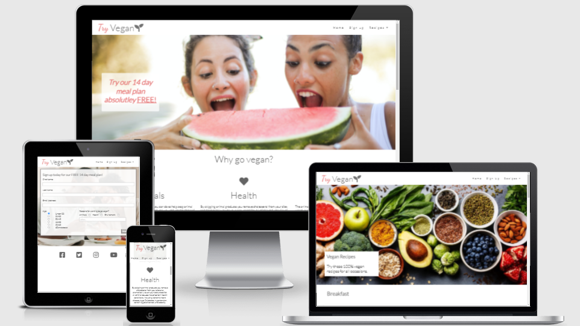

## Design

- __Colour scheme__
    - The colour scheme I chose for the site is pink (RGB 26,98,98) and grey (RGB 100,100,100).
    - All grey links will either highlight pink or show a pink underline on hover.  

- __Typography__
    - Lato is the main font throughout the site using Sans serif as the back up. Lato is a very standard looking font and easy to read.
    - Dancing Script was used once to create part of the logo. The font has a 'flow' giving the logo a gentle nature which is fitting for the site.

- __Imagery__
    - All of the images have a light and airy feel. The main hero image on the landing page also fits the colour scheme with the pink of the watermelon.
    - The recipe images are simplistic which ties in with the look of the site.

- __Wireframes__
    ## Index page wireframe   

    ## Recipe page wireframe   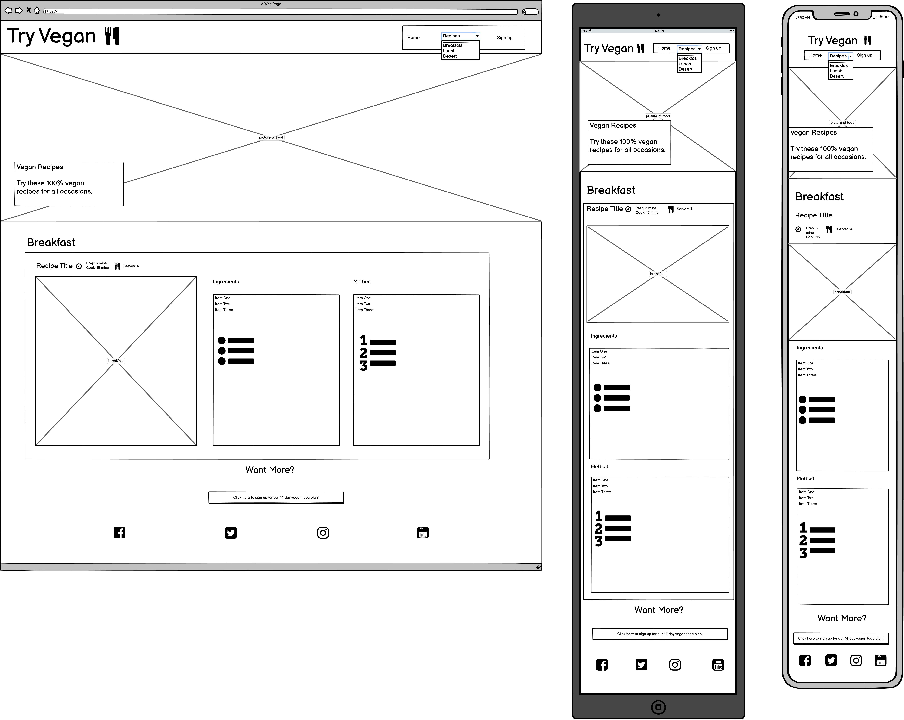

    ## Sign up page wireframe   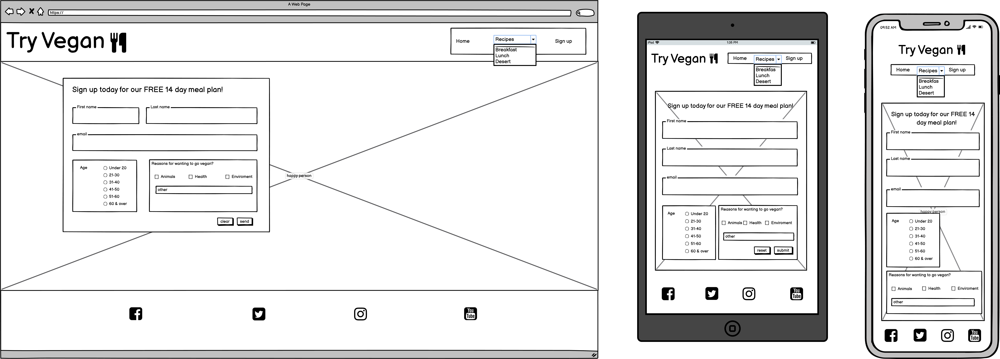

## Features

- __Navigation bar__

    - The navigation bar appears across the top of every page. 
    - It has clear links to the three pages, home, sign up and recipes, with the recipes expanding into 3 separate sections, breakfast, lunch and desert.
    - The nav bar will stick to the top of the page making navigation for the user easily accessible at all times. 
    - The logo and navigation elements have falling animations to draw the users attention to them.

    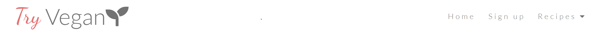

- __Landing Page image__

    - The landing page hero image is in fitting with the sites goal and has a clear text overlay suggesting the user to try the 14 day meal plan. 
    - Hovering over the text will create a shadow round the box giving the notion that the text is a clickable button. Clicking the box will link the user to the sign up page. 

     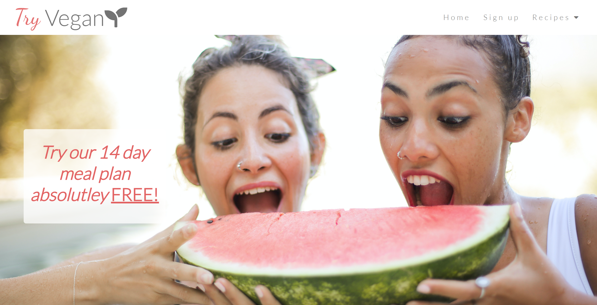
    

- __Why section__

    - This section introduces the user to the benefits of a vegan diet. 
    - Each section is accompanied by a trailer to a relevant documentary and a link to their web page to aid the user in gaining more information on the subject. 
    - All this information encourages the user to view the recipes and sign up to the meal plan.
    
    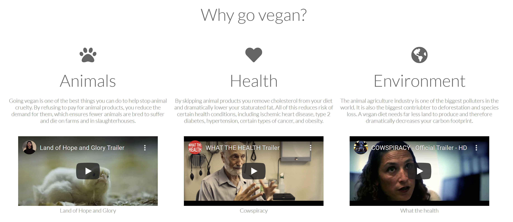

- __Recipe Link Section__

    - This recipe link section provides the user with appealing imagery with food and two links to other areas of the website. The first being a button that takes them to the sign up page:

    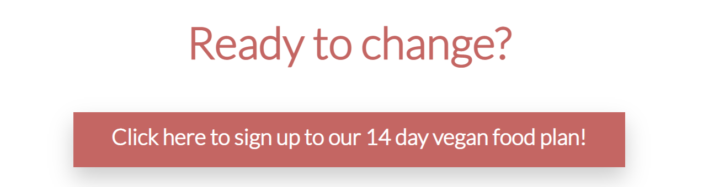

    And the second is a clickable text taking them to the recipes page:

    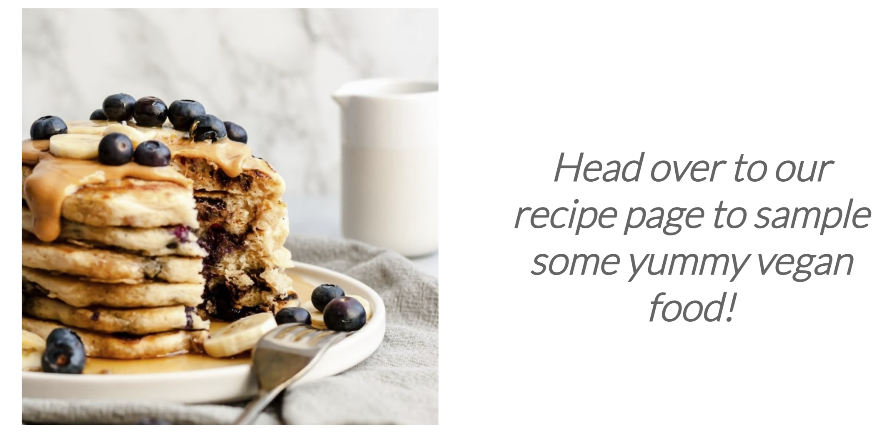

    - The function of this section is to keep the user engaged with the site by directing them to the recipes and sign up page with ease.

- __Footer__
    - The footer has links to all the relevant social media pages. 
    - This is valuable to the user as the social media sites will contain more content.

    

- __Recipe Page__

    - The recipe page introduces the user to 3 sample recipes.
    - This gives the user an example of what they can expect in the meal plan should they sign up.

    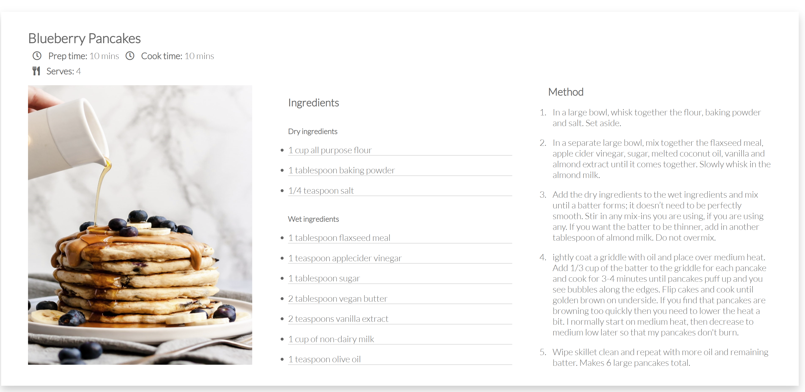

- __Sign up page__
    - The sign up page allows the user to sign up for the 14 day meal plan. 
    - The user will be asked for their name and email address along with their age range and the reasons for wanting to try veganism. 
    
    

- __404 page__
    - The 404 error page displays when an incorrect URL has been entered or the page is missing.
    - From this page the user can easily navigate back to the home page.

    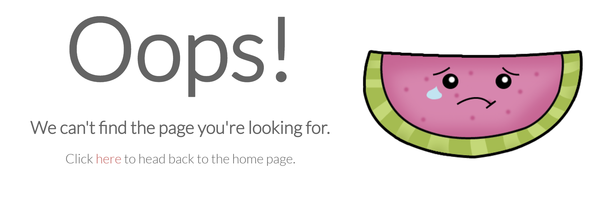

### Features left to implement

- User ratings of recipes
- Calendar for vegan food markets/events coming up

## Testing

- __Validators__
    - All HTML was ran through W3C validator and came back with no errors.
        - Home Page
        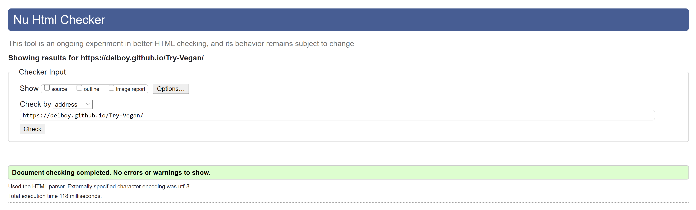
        - Recipe Page
        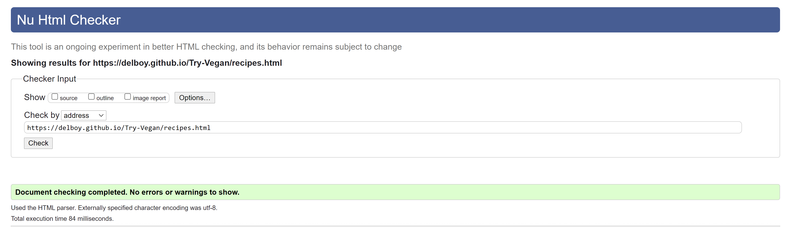
        - Sign-up page
        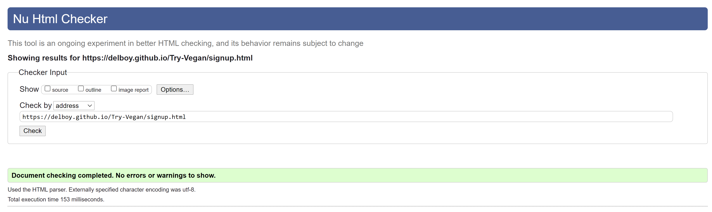
        - 404 Page
        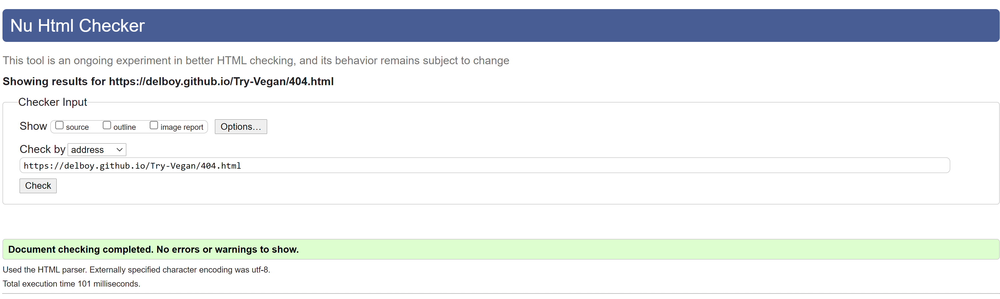
    - All CSS was ran through W3C Jigsaw validator and came back with no errors.
    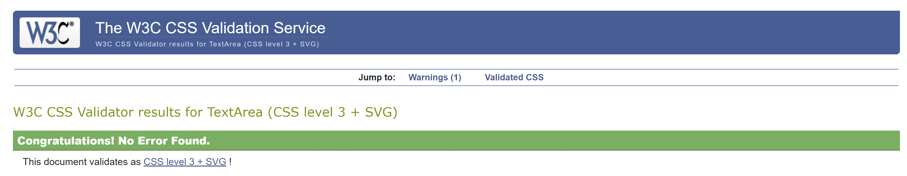

- __Further Testing__
    - The site was tested on google chrome, edge and safari browsers.
    - The site was viewed on multiple devices such as desktop (including an ultra wide monitor), iphone, ipad, ipad mini, and laptop. 
    - All links were checked extensively to make sure they direct the user to the correct location.
    - All media players were tested to work correctly.
    - The form was tested multiple times with various inputs all resulting in a successful submit.

## Deployment

 - The website was deployed to Github pages. This was done as follows:
    - From the Github repository go to 'Settings'.
    - From there navigate to the section 'Pages'. 
    - From the dropdown menu in the section labeled 'Source' choose the option 'Master Branch' and click 'Save'.
    - Once saved a notification informing you the site has been published will appear with a link to the website.

    The live link can be found here - https://delboy.github.io/Try-Vegan/

## Credits

### __Content__

- The idea for the dropdown menu was shown to me by Ed Bradley at [W3Schools](https://www.w3schools.com/howto/howto_css_dropdown_navbar.asp)
- The idea for the animations across the page was influenced by The Net Ninja youtube channel. Specifically this [video](https://www.youtube.com/watch?v=PjR97QzOrJM&t=306s) 
- The solution for a problem I had with some form elements creating a scroll bar was found on [stack overflow](https://stackoverflow.com/questions/5219175/how-to-make-an-element-width-100-minus-padding)
- The text for the Health section on the home page was taken from [animalaid.org](https://www.animalaid.org.uk/)
- The vegan pancakes recipe was taken from [Ambitiouskitchen.com](https://www.ambitiouskitchen.com/fluffy-vegan-pancakes/)
- The vegan burrito recipe was taken from [Frommybowl.com](https://frommybowl.com/rice-bean-burritos/)
- The peanut butter cookie bars recipe was taken from [lovenadlemons.com](https://www.loveandlemons.com/peanut-butter-chocolate-chip-cookie-bars/)
- The Icons in the footer and the icon in the logo were taken from [Font Awesome](https://fontawesome.com/)

### __Media__

- The hero and form page image was sourced from the open source site [Pexels](https://www.pexels.com/.) 
- The picture of people eating around a table on the home page was found [here](https://www.connexionfrance.com/French-news/French-study-finds-social-meals-increase-Covid-contamination)
- The vegetable spread used on the Recipe page was found at [chooseveg.com](https://chooseveg.com/blog/what-you-need-to-know-about-the-vegan-food-pyramid/)
- The images of the pancakes were taken from  [Ambitiouskitchen.com](https://www.ambitiouskitchen.com/fluffy-vegan-pancakes/)
- The image of the burrito was found on [acouplecooks.com](https://www.acouplecooks.com/vegan-burrito/)
- The Peanutbutter square image was taken from [lovenadlemons.com](https://www.loveandlemons.com/)
- The trailer for Land of Hope and Glory was sourced form [Earthling Eds](https://www.youtube.com/channel/UCVRrGAcUc7cblUzOhI1KfFg) youtube channel 
- The trailer for What the Health was sourced from there [Youtube](https://www.youtube.com/channel/UCDVUqyG8R9Z0diJRU-YO3KA) channel
- The Cowspiracy trailer was sourced from there [Youtube](https://www.youtube.com/channel/UCamf6YZ_Xo9vbcynZJwvdMA) channel
- The watermelon picture on the 404 page was from the open source site [deviantart.com](https://www.deviantart.com/renbunny/art/Sad-Watermelon-554531253)

