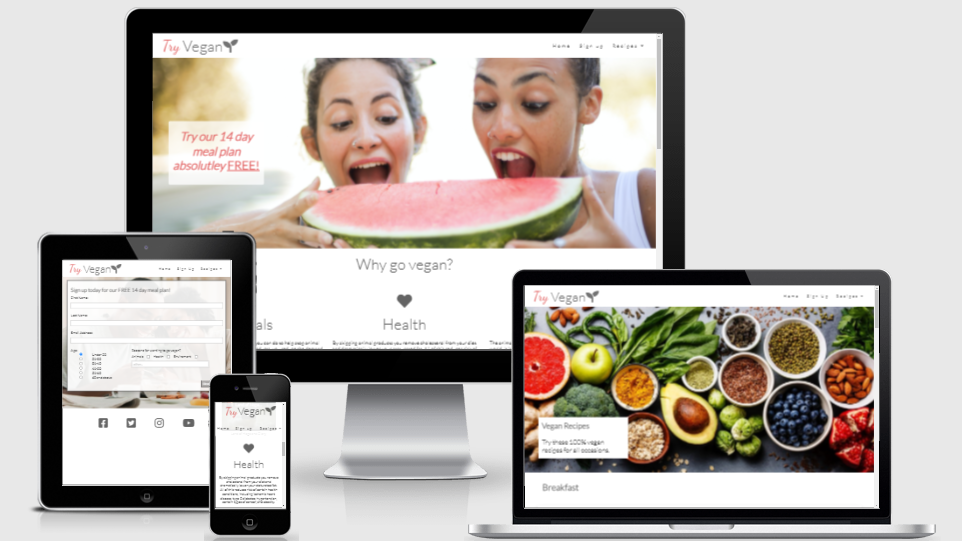
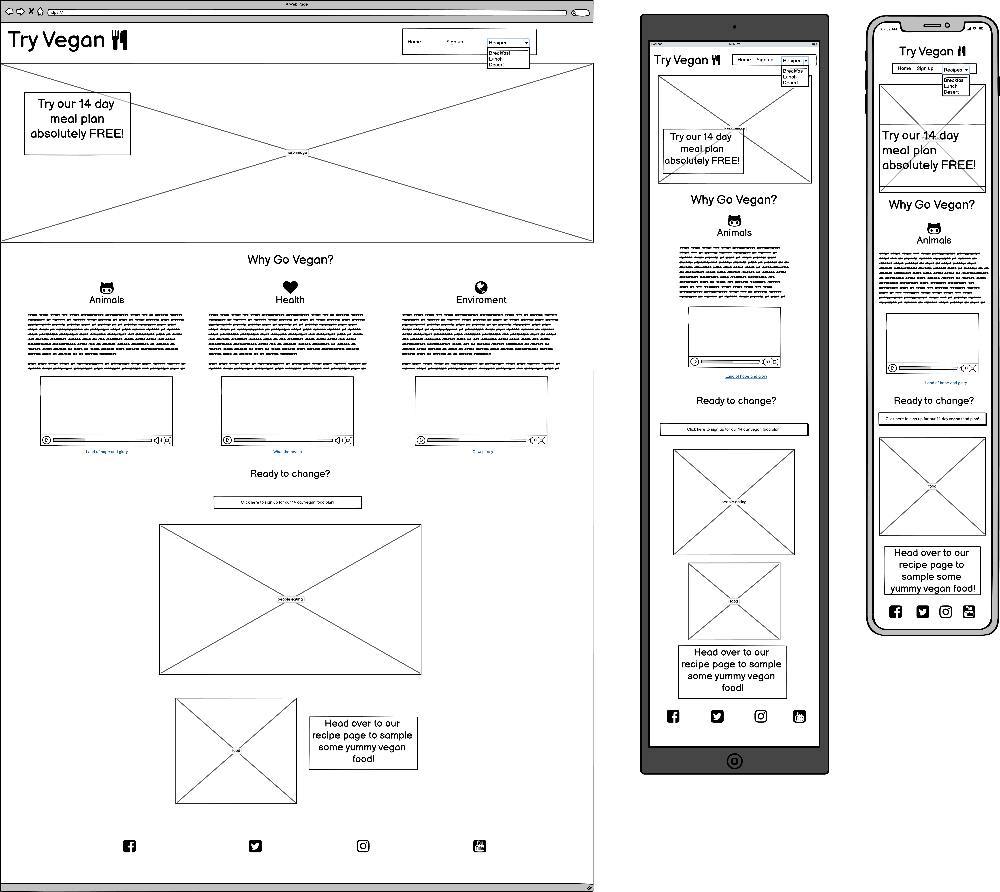
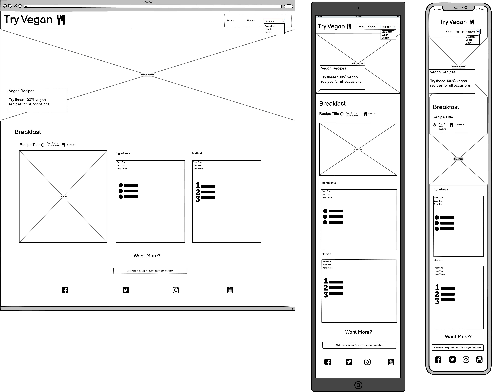
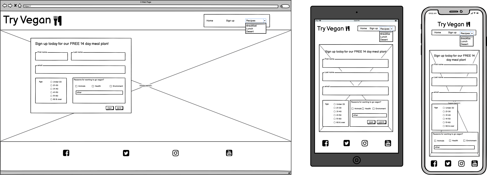
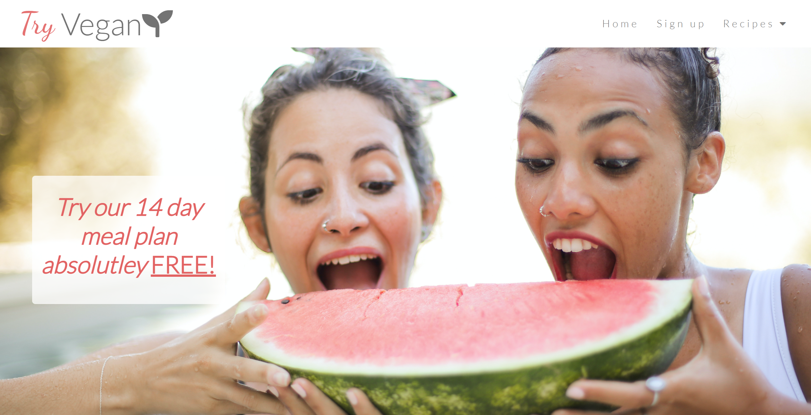
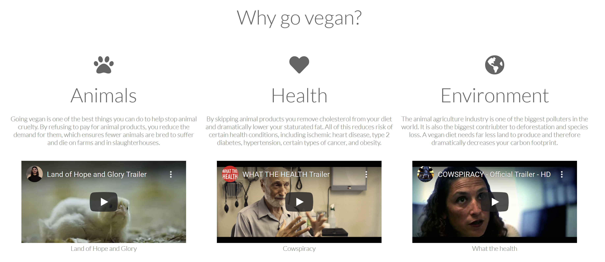
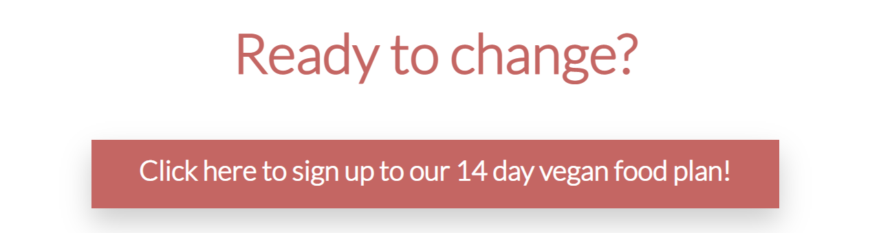
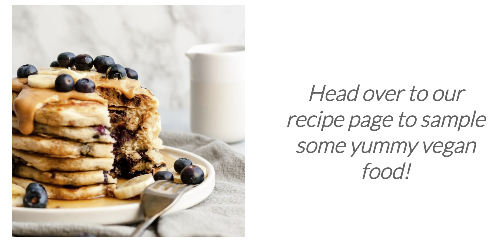
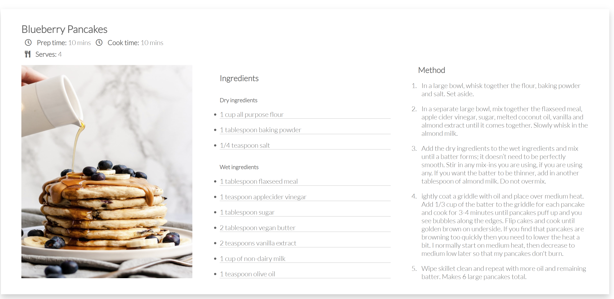

# Try Vegan

[Try Vegan](https://delboy.github.io/Try-Vegan/) is a responsive website designed to inform the user of the benifits of veganism and aid them with vegan recipes and meal plans. The site is targeted towards non-vegans who are looking to make the change, be it for animal rights, health or environmental reasons. The site will be useful for anyone interested in learning about veganism and looking to trial some vegan recipes.

## USer Experience (UX)

Vistors to this page would be people interested in learning more about veganism and especially vegan food. On visting the site they should be able to:
- Understand the main purpose of the website.
- Navigate around the site and to all page.

 
- __Design__
    - Colour scheme
        - The colour scheme I chose for the site is pink (RGB 26,98,98) and grey (RGB 100,100,100).
        - All grey links will either highlight pink or show a pink underline on hover.  

    - Typography
        - Lato is the main font throughout the site using Sans serif as the back up. Lato is a very standard looking font and easy to read.
        - Dancing Script was used once to create part of the logo. The font has a 'flow' giving the logo a gentle nature which is fitting for the site.

    - Imagery
        - All of the images have a light and airy feel. The main hero image on the landing page also fits the colour scheme with the pink of the watermelon.
        - The recipe images are simplisitic which ties in with the look of the site.

- __Wireframes__
    ### Home page wireframe   

    ### Recipe page wireframe   

    ### Sign up page wireframe   

## Features

- __Naviagation bar__

    - The navigation bar appears across the top of every page. 
    - It has clear links to the three pages, home, sign up and recipes, with the recipes expanding into 3 seperate sections, breakfast, lunch and desert.
    - The nav bar will stick to the top of the page making navigation for the user easily accesible at all times. 
    - The logo and navigation elements have falling animations to draw the users attention to them.

    

- __Landing Page image__

    - The landing page hero image is in fitting with the sites goal and has a clear text overlay suggesting the user to try the 14 day meal plan. 
    - Hovering over the text will create a shadow round the box giving the notion that the text is a clickable button. Clicking the box will link the user to the sign up page. 

     
    

- __Why section__

    - This section introduces the user to the benifits of a vegan diet. 
    - Each section is accompanied with a trailer to a relevant documentry with a link to their webpage to aid the user in gaining more information. 
    - All this information encourages the user to view the recipes and sign up to the meal plan.
    
    

- __Recipe Link Section__

    - This recipe link section provides the user with appealing imagery with food and two links to other areas of the website. The first being a button that takes them to the signup page:

    

    And the second is a clickable text taking them to the recipes page:

    

    - The function of this section is to keep the user engaged with the site by directing them to the recipes and sign up page with ease.

- __Footer__
    - The footer has links to all the relevant social media pages. 
    - This is valuable to the user as the social media sites will contain more content.

    

- __Recipe Page__

    - The recipe page introduces the user to 3 sample recipes.
    - This gives the user an example of what they can expect in the meal plan should they sign up.

    

- __Sign up page__
    - The sign up page allows the user to sign up for the 14 day meal plan. 
    - The user will be asked for their name and email address along with their age range and the reasons for wanting to try veganism. 
    

### Features left to implelement

- User ratings of recipes
- Calender for vegan food markets/events coming up

## Testing

- __Validators__
    - All HTML was ran through W3C validator and came back with no errors.
    - All CSS was ran through W3C Jigsaw vaidator and came back with no errors.

- __Further Testing__
    - The site was tested on google chrome, edge and safari browsers.
    - The site was viewed on multiple devices such as desktop (including an ultrawide monitor), iphone, ipad, ipad mini, and laptop. 
    - All links were checked thouroughly to make sure they direct the user to the correct location.
    - All media players were tested to work correctly.

## Unfixed Bugs

## Deployment

## Credits

### Content

### Media

